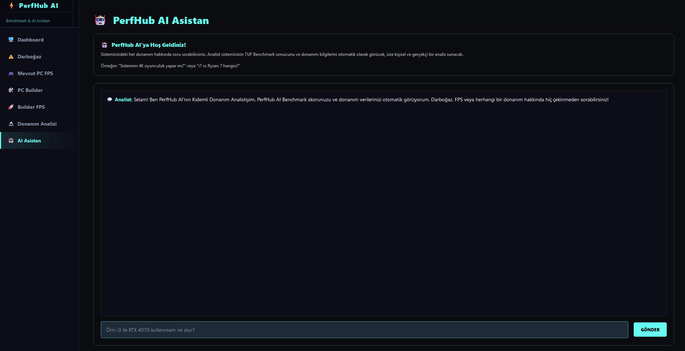
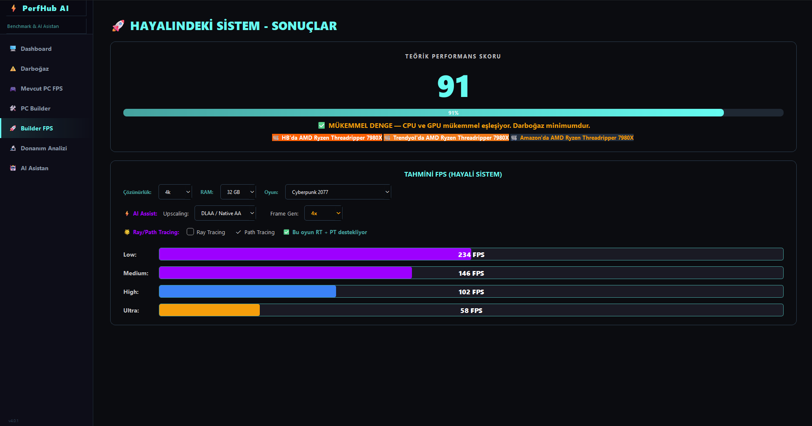

# 🚀 PerfHub AI

Hardware analysis and FPS prediction for PC gaming — pick a CPU, GPU and RAM
configuration and see what frame rates to expect across 176 games.

[](https://perfhub.suleymankilinc.com)


## 🌐 Try it now

**[perfhub.suleymankilinc.com](https://perfhub.suleymankilinc.com)** — no install,
no download. Choose your parts and get FPS estimates for every game in the
database, along with warnings when a build is going to run into trouble.

Predictions run **in the browser**, not on a server. The engine is a pure
function over an 84 KB catalogue, so it ships with the page and answers
instantly — no request, no cold start, and nothing to be down. Only the AI
assistant needs a backend.

A Windows desktop build is also available with automatic hardware detection —
see [Desktop application](#-desktop-application).

## ⚙️ Cadence — the prediction engine

Most estimators multiply one "difficulty" number by a chain of correction
factors. **Cadence** models frame time instead: a game costs the CPU some
milliseconds per frame and the GPU some milliseconds per frame, and the slower
of the two is what you actually get. It is named for frame cadence because
that is literally the quantity it computes — frames per second is the output,
not the model.

```
ft = (ft_cpu^k + ft_gpu^k)^(1/k)        fps = 1000 / ft
```

Working this way means the interesting behaviour is a consequence of the model
rather than a special case bolted on:

| Behaviour | Why it happens |
|---|---|
| CPU-limited games stop scaling with a bigger GPU | the CPU term stops shrinking |
| Higher resolutions shift the limit back to the GPU | only the GPU term grows with pixel count |
| Frame generation helps most when the CPU is the wall | generated frames need no CPU simulation |
| Upscaling gains shrink once the CPU becomes the limit | it only reduces rendered pixels |

**Memory is modelled explicitly.** VRAM demand is estimated per game, preset and
resolution, then compared against the card. Anything that does not fit spills
across PCIe into system RAM, and if system RAM cannot absorb the spill either,
the result is reported as unplayable instead of being given an optimistic
number. An 8 GB card running a heavy title at 1440p Ultra will warn about a
crash risk on 16 GB of RAM, and report a playable-but-badly-degraded result on
32 GB — which is the difference a buyer actually needs to know about.

Accuracy is measured, not asserted. The engine is fitted against 480 recorded
benchmark results covering resolution sweeps, GPU and CPU ladders, preset
ladders, ray tracing, upscaling, frame generation and 8GB-vs-16GB VRAM pairs
of the same GPU. Current standing against that set:

| Metric | Value |
|---|---|
| Mean absolute error | **6.8%** |
| Systematic bias | −0.9% |
| Within 20% of measured | 93% |

A further 12 measurements are held out of the fit entirely — free gameplay
rather than benchmark loops, on hardware nothing else covers — and the engine
answers those to 19.6%. That is the number that says whether it generalises,
so it is reported separately rather than averaged in. Predictions on
pre-2019 graphics architectures are unvalidated, and the interface says so
rather than presenting them at the same confidence.

RTX 4090 + Ryzen 7 7800X3D in Cyberpunk 2077 at Ultra, native, no ray tracing:

| Resolution | Predicted | Measured |
|---|---|---|
| 1080p | 142 fps | 140 fps |
| 1440p | 117 fps | 125 fps |
| 4K | 66 fps | 60 fps |

Hardware scores are held to the same standard. Checking the 164 GPUs against a
published performance hierarchy found the ladder systematically compressed —
every one of the 48 cards covered was predicted too fast relative to an
RTX 5090 — and correcting it resolved a measurement contradiction that had been
logged as unexplained. The 220 CPUs were worse: they ranked all-core
throughput, so a Core Ultra 9 285K outscored a Ryzen 7 9800X3D, which is the
reverse of how they behave in games. They are now a 1080p gaming index.
`scripts/calibrate_gpu_scores.py` and `scripts/calibrate_cpu_scores.py` re-run
both checks.

`scripts/validate_engine.py` reports that error on demand and
`scripts/calibrate_engine.py` refits the constants, so a tuning change can be
judged rather than argued about.

## ✨ Features

### Gaming & performance
- **FPS prediction** across 176 games, from Very Low to Extreme presets
  (clamped per game — a title only offers the tiers it really ships)
- **Upscaling** — DLSS, FSR and XeSS, applied to rendered pixels, with a
  warning when the selected game does not support the chosen technology
- **Frame generation** — 2x/3x/4x, including the VRAM cost and the GPU
  overhead of producing the extra frames
- **Ray tracing / path tracing** — modelled against GPU frame time and VRAM
  separately, for the games that support each
- **VRAM and system RAM pressure** — spill, thrashing and crash conditions
- **Bottleneck analysis** — reports whether the CPU or the GPU binds first

### Hardware database
- **222 CPUs** — Intel Core / Core Ultra / Xeon, AMD Ryzen & Threadripper,
  Apple Silicon, scored on 1080p gaming rather than all-core throughput
- **164 GPUs** — NVIDIA GTX 700 through RTX 50, AMD Polaris through RDNA 4,
  Intel Arc, plus integrated graphics
- **176 games** — per-title CPU and GPU cost, VRAM and RAM working sets,
  RT/PT and DLSS/FSR/XeSS support flags
- Laptop and desktop parts are distinguished, and a laptop chip is never
  allowed to outscore the desktop part it is named after

### AI assistance
- Hardware consulting and upgrade suggestions in Turkish or English
- Web backend uses Google Gemini; the desktop app uses a Groq-hosted Llama
  model

## 🏗️ Architecture

```
perfhub-ai/
├── core/                      # Shared engine — used by both frontends
│   ├── scoring_engine.py      # Frame-time FPS model
│   ├── balance_config.py      # Tuning constants (calibration lives here)
│   ├── db_manager.py          # SQLite access
│   ├── hardware_detector.py   # WMI hardware detection (Windows only)
│   └── ai_assistant.py        # AI integration
├── backend/                   # FastAPI service — AI assistant only
├── frontend/                  # React + Vite web interface
│   └── src/engine/            # Cadence in TypeScript, runs in the browser
│       ├── cadence.ts             # Hand-ported model
│       ├── balance.generated.ts   # Generated from balance_config.py
│       └── catalog.generated.json # Generated from the database
├── data/hardware_db.sqlite    # CPU / GPU / game database
├── scripts/
│   ├── calibrate_gpu_scores.py   # Validate GPU scores against a reference
│   ├── calibrate_cpu_scores.py   # Rebuild CPU scores as a gaming index
│   ├── calibrate_engine.py       # Fit per-game costs and multipliers
│   ├── validate_engine.py        # Benchmark accuracy harness
│   ├── export_engine_data.py     # Push constants + catalogue to the web build
│   └── conformance_test.py       # Prove the two engines agree
└── modern_desktop_app.py      # PyQt6 desktop application
```

`core/` is the single source of truth. The desktop app calls it directly; the
website runs a TypeScript port so a prediction needs no server round trip.

Two implementations can drift, so the split is deliberate: every constant and
the whole catalogue are **generated** from the Python source and never edited
by hand, which leaves only the model logic hand-written — and
`scripts/conformance_test.py` runs both over ~25,000 cases and fails on any
disagreement, down to the warning strings. It caught a real one during the
port: Python rounds half to even and `Math.round` does not, so a frame rate
landing exactly on a half disagreed by one.

## 🚀 Running locally

### Backend + web frontend

```bash
git clone https://github.com/SuleymanKilincc/perfhub-ai.git
cd perfhub-ai

# Backend (http://localhost:8000)
pip install -r backend/requirements.txt
uvicorn backend.main:app --reload

# Frontend (http://localhost:3000), in a second terminal
cd frontend
npm install
npm run dev
```

Set `VITE_API_URL` in `frontend/.env` to point the interface at a different
backend — see `frontend/.env.example`.

AI features need a `GEMINI_API_KEY` environment variable. Never commit keys to
the repository; the `.gitignore` blocks the usual filenames.

### Desktop application

Requires Windows — hardware detection uses WMI.

```bash
pip install -r backend/requirements.txt
pip install PyQt6 wmi pywin32
python modern_desktop_app.py     # or: start_desktop.bat
```

Prebuilt releases are on the
[Releases page](https://github.com/SuleymanKilincc/perfhub-ai/releases).
Windows will show an "Unknown publisher" warning for unsigned builds —
choose **More info → Run anyway**.

## 🔬 Improving accuracy

Twenty-nine of the 176 games have cost profiles fitted to real measurements. The
rest still carry values derived from the previous model and blended with genre
priors — reasonable starting points, not measurements — so the accuracy figure
above describes the measured set rather than the whole catalog.

```bash
python scripts/validate_engine.py          # report mean error
python scripts/validate_engine.py --add    # record a measurement
python scripts/calibrate_vram.py --apply   # fit VRAM working sets
python scripts/calibrate_engine.py --apply # fit costs and multipliers
```

The most valuable single contribution is one game on one system across all
three resolutions: that is the only thing that separates a game's CPU cost
from its GPU cost. See [CALIBRATION.md](CALIBRATION.md) for current standing,
known gaps and what is worth measuring next.

## 🤝 Contributing

Contributions are welcome. Benchmark measurements are as useful as code —
every verified anchor makes the model measurably better.

## 📝 License

MIT — see [LICENSE](LICENSE).

## 👨‍💻 Author

**Süleyman Kılınç**
- Website: [suleymankilinc.com](https://suleymankilinc.com)
- GitHub: [@SuleymanKilincc](https://github.com/SuleymanKilincc)

## 📸 Screenshots

### Dashboard


### FPS Prediction

