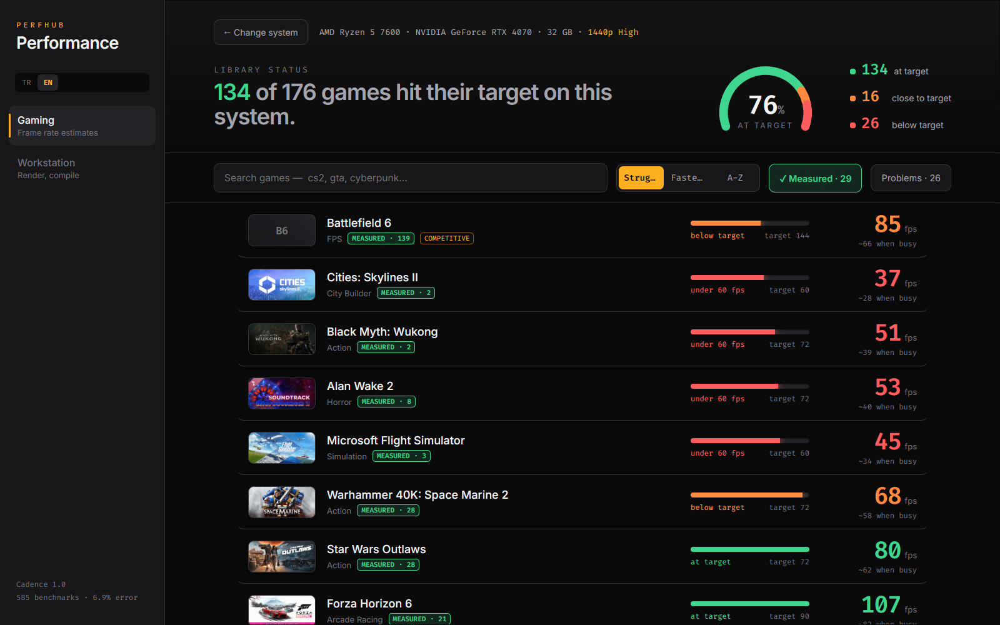
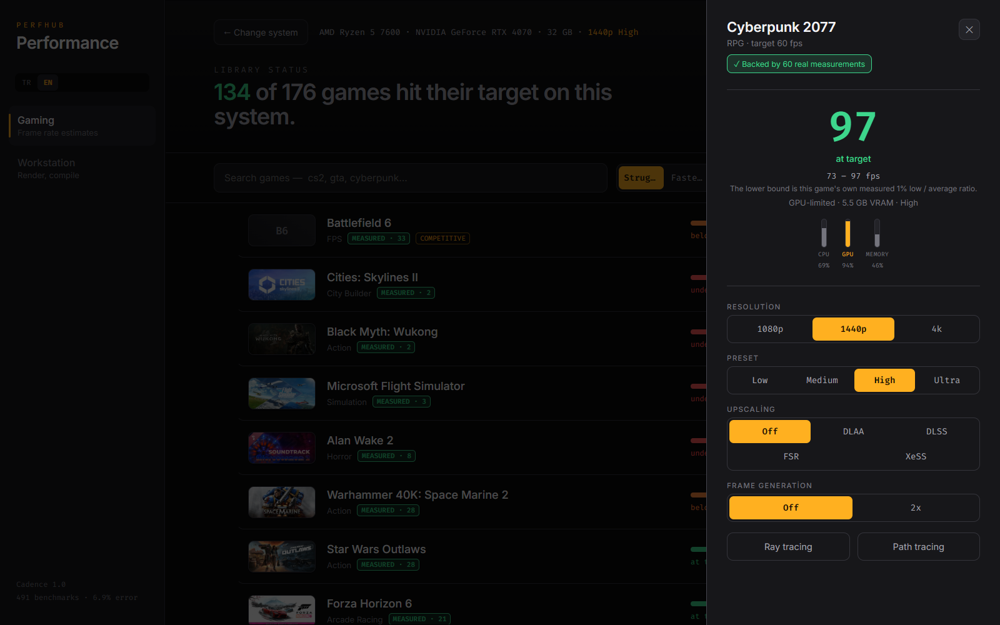

# PerfHub

Frame-rate estimates for a CPU, GPU and RAM combination across 176 PC games,
computed in the browser and checked against 577 recorded benchmark results.

[](https://perfhub.suleymankilinc.com)
[](LICENSE)

**[perfhub.suleymankilinc.com](https://perfhub.suleymankilinc.com)** — no
install, no account. Choose a processor, a graphics card, RAM, resolution and
preset, and every game in the catalogue is scored for that machine.



## What it is, and what it is not

PerfHub predicts the **average frame rate of a benchmark run** and the range a
player should expect when a scene gets busy. It is a model fitted to
measurements, not a lookup table and not a language model. How much to trust a
given number depends on whether that game has been measured, and the interface
says which:

- **29 games are measured.** Their cost profiles are fitted to recorded
  benchmarks, and on those rows the engine is within 6.9% on average.
- **147 games are derived** from a hand-built profile and a genre prior. Tested
  by holding each measured game out and deriving it as if it had never been
  measured, that method is about 52% out. These games are labelled as
  estimates, and the results list shows only measured games by default.

The full accounting — what has been fitted, what has been held out, every
known gap and every mistake along the way — is in
[CALIBRATION.md](CALIBRATION.md).

## Accuracy

Every figure here is produced by `scripts/validate_engine.py` and
`scripts/export_engine_data.py` against the recorded data.

| Set | Rows | Mean error | Bias |
|---|---|---|---|
| Fitted benchmark runs | 491 | **6.9%** | +0.1% |
| Held out: free gameplay | 74 | 32.0% | +13.3% |
| Held out: optional HD texture packs (not modelled) | 8 | 44.3% | +14.4% |
| Held out: DLSS Ray Reconstruction (not modelled) | 4 | 16.9% | 0.0% |

On the fitted set, 80% of predictions land within 10% of the measured value and
94% within 20%.

The held-out rows are the ones the fit never sees, and they are reported
separately because they answer a different question. Free gameplay reads
lower than a benchmark loop — the model predicts benchmark averages, and
measured on one graphics card, Cyberpunk 2077's built-in benchmark runs 1.7x
faster than free play in its city at 1440p. That gap is measured but not yet
corrected; see gap 10 in the calibration log.

One configuration, shown with its error rather than chosen for it — Cyberpunk
2077 at Ultra, native, no ray tracing, RTX 4090 with a Ryzen 7 7800X3D:

| Resolution | Predicted | Measured | Error |
|---|---|---|---|
| 1080p | 165 fps | 140 fps | +18% |
| 1440p | 127 fps | 125 fps | +2% |
| 4K | 69 fps | 60 fps | +15% |

## How the engine works

The engine, Cadence, models frame time rather than frame rate. A game costs
the processor some milliseconds per frame and the graphics card some
milliseconds per frame, and the slower of the two sets the pace:

```
ft = (ft_cpu^k + ft_gpu^k)^(1/k)        fps = 1000 / ft
```

Most of the behaviour people care about follows from that one equation instead
of being added as a special case:

| Behaviour | Why it happens |
|---|---|
| A faster GPU stops helping in CPU-limited games | the CPU term stops shrinking |
| Higher resolutions move the limit back to the GPU | only the GPU term grows with pixel count |
| Upscaling gains shrink once the CPU is the limit | upscaling only reduces rendered pixels |
| Frame generation helps most when the CPU is the wall | generated frames need no CPU simulation |

**Memory is modelled separately.** VRAM demand is estimated per game, preset
and resolution and compared with the card. What does not fit spills across
PCIe into system RAM, and if system RAM cannot absorb it either the result is
reported as unplayable rather than given an optimistic number.

**Ray tracing is per game where it has been measured.** Turning it on costs
Far Cry 6 a factor of 1.10 in frame rate and Hitman a factor of 3.25 to 3.67
across three independent measurements; one global multiplier cannot describe
both. Games measured with ray tracing on and off carry their own cost, and the
rest fall back to a global average.

**Hardware scores were rebuilt against published data.** The GPU ladder was
checked against a 1440p performance hierarchy and found systematically
compressed; the CPU scores ranked all-core throughput and were rebuilt as a
1080p gaming index.

## Known limitations

- 147 of 176 games are estimates, as above.
- 8 of the 29 measured games have only processor-limited measurements, so
  their graphics cost has never been tested; the interface flags this.
- AMD graphics cards have very few measurements; laptop hardware has none.
- Pre-2019 GPU architectures are unvalidated, and the interface says so.
- Not modelled: MSAA, optional high-resolution texture packs, DLSS Ray
  Reconstruction, and how much a game's cost varies between areas of the same
  game.

The most useful single contribution is one game on one system at three
resolutions — see [Contributing](#contributing).

## Features

- Frame-rate estimates with an expected range; for 19 games the lower bound
  comes from that game's own measured 1%-low ratio
- A per-game breakdown of how busy the CPU, GPU and memory are, and a
  machine-level note when a build is lopsided, naming the smallest part that
  would even it out
- DLSS, FSR and XeSS upscaling, 2x/3x/4x frame generation, ray tracing and
  path tracing, applied only where the game supports them
- VRAM and system-RAM pressure, including spill and out-of-memory conditions
- 222 CPUs and 164 GPUs, desktop and laptop kept separate
- Turkish and English interface; shareable result links



## How this project was built

PerfHub is built by two contributors, and the split is deliberate.

**Süleyman Kılınç** — product direction and the measurement programme. That
means sourcing the 577 benchmark results from published reviews and benchmark
videos, supplying and checking them, deciding what to measure next, and using
the site against real hardware. Several defects in the log were found that
way: an inflated VRAM figure for Red Dead Redemption 2 traced to MSAA, upscaling
having no effect in Assetto Corsa Competizione, laptop and desktop parts being
mixable in one build.

**Claude (Anthropic), through Claude Code** — the code and the analysis: the
engine and its calibration, both implementations, the web interface, the data
scripts and the reasoning recorded in CALIBRATION.md. Commits Claude wrote carry
a `Co-Authored-By` line.

None of the accuracy claims depend on taking either of our words for it. They
are regenerated by the scripts in `scripts/` from the recorded measurements, and
the calibration log includes the claims that turned out to be wrong.

## Architecture

```
perfhub-ai/
├── core/                         Engine used by every front end
│   ├── scoring_engine.py         Frame-time model
│   ├── balance_config.py         Fitted constants
│   ├── db_manager.py             SQLite access
│   └── hardware_detector.py      Hardware detection for the desktop app
├── frontend/                     React + Vite web interface
│   └── src/engine/
│       ├── cadence.ts            The engine, ported to TypeScript
│       ├── balance.generated.ts  Generated from balance_config.py
│       └── catalog.generated.json Generated from the database
├── backend/                      FastAPI service for the chat assistant
├── data/hardware_db.sqlite       Hardware, games and benchmark results
└── scripts/
    ├── validate_engine.py        Accuracy against the recorded benchmarks
    ├── calibrate_engine.py       Fits per-game costs and multipliers
    ├── calibrate_vram.py         Fits VRAM working sets
    ├── calibrate_fps_low.py      Fits per-game 1%-low ratios
    ├── export_engine_data.py     Generates the web engine's data and figures
    ├── conformance_test.py       Checks the two engines agree
    └── load_benchmarks_*.py      One script per batch of measurements
```

`core/` is the source of truth. The website runs a TypeScript port so that a
prediction needs no server: the engine and a ~140 KB catalogue ship with the
page. Two implementations can drift, so every constant and the catalogue are
generated rather than edited by hand, and `scripts/conformance_test.py` runs
both engines over 4,384 generated cases and fails on any difference across 16
output fields.

## Running locally

```bash
git clone https://github.com/SuleymanKilincc/perfhub-ai.git
cd perfhub-ai

# Web interface (http://localhost:3000)
cd frontend
npm install
npm run dev
```

The prediction engine needs nothing else. The chat assistant on the previous
interface (`/classic.html`) needs the backend and a `GEMINI_API_KEY`:

```bash
pip install -r backend/requirements.txt
uvicorn backend.main:app --reload
```

To check or refit the model:

```bash
python scripts/validate_engine.py            # accuracy report
python scripts/calibrate_engine.py --apply   # refit costs and multipliers
python scripts/export_engine_data.py         # regenerate the web data
python scripts/conformance_test.py           # confirm both engines agree
```

## Desktop application

A Windows build with automatic hardware detection calls the same `core/`
engine; its interface predates the current website. Requires Windows, since
detection uses WMI.

```bash
pip install -r backend/requirements.txt
pip install PyQt6 wmi pywin32
python modern_desktop_app.py
```

Builds are on the [Releases page](https://github.com/SuleymanKilincc/perfhub-ai/releases).
They are unsigned, so Windows shows an "Unknown publisher" warning.

## Contributing

Measurements are worth as much as code. The most useful one is a single game on
a single system at 1080p, 1440p and 4K — that is what separates a game's CPU
cost from its GPU cost. Useful details: the exact CPU and GPU (including the
memory variant), RAM, preset, upscaling mode, whether frame generation and ray
tracing were on, and whether the numbers come from the game's built-in
benchmark or from free play. [CALIBRATION.md](CALIBRATION.md) lists what is
most needed.

## License

MIT — see [LICENSE](LICENSE).

## Author

Süleyman Kılınç — [suleymankilinc.com](https://suleymankilinc.com) ·
[@SuleymanKilincc](https://github.com/SuleymanKilincc)
